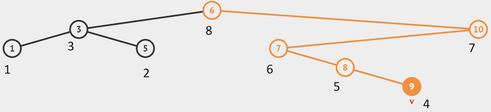
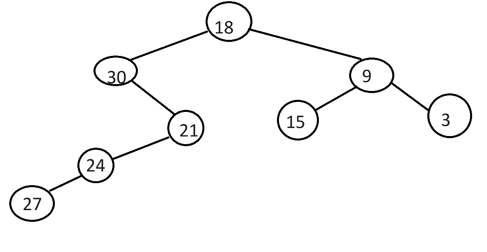

# quiz-2-strukdat

### Note
Due to some syntax, this program requires C++11 or above for it to run properly.

## Problem 1
Write a recursive function to print the depth-first traversal of a tree, i.e., choosing left branches first.

### Solution
Reading from the problem statement, post-order traversal can be used to traverse the tree from its left branches first then to the right by using recursion. Then, we need to print the node's value after the traversal from leaves to root.

```cpp
void printDepthFirst (Node *root) {
    if (root != nullptr) {
		printDepthFirst(root -> left);
		printDepthFirst(root -> right);
		printf("%d ", root -> data);
	}
}
```
By simply checking if the root's value is not `nullptr`, we can know that the root has a value so there won't be any errors while printing the value.
Output:

Post-Order Printing:


Time Complexity: O(Number of Nodes)

## Problem 2
Write a recursive function to print all nodes at the k-th level in the binary tree.

### Solution
With the structure of the function requested by the problem being `void printKthLevel(Node *root, int k)`, it can be difficult to know which level the node root parameter is. To solve this issue, we can use the `static` keyword where it declares the variable only once and the value of the variable will be retained between function calls. We can declare a static variable named `lvl` (`static int lvl = 0;`) to keep track of the level of the node that the `Node *root` is in.
```cpp
void printKthLevel(Node *root, int k) {
	static int lvl = 0; // first declaration of lvl will be lvl = 0, after this declaration, the value of lvl will be retained between function calls
	if (root) { // check if the node actually exists
		if (lvl == k) {
			printf("%d ", root->data); // print the value of the node if the level of the node is equal to k
		} else {
			lvl++; // reminder that we need to manually add and subtract the level when we traverse to other nodes
			printKthLevel(root->left, k);
			printKthLevel(root->right, k);
			lvl--;
		}
	}
}
```

For problem 2, the current binary search tree will look like the image above.

Running program:

Time Complexity: O(Number of Nodes)

## Problem 3
Write a recursive function to calculate the sum of all nodes in the binary tree.

### Solution
To solve this problem, we can assume that every root has at least one child, the recursive goes from getting the root's value, then add with its children values.

```cpp
int sumOfNodes(Node *root) {
    if (root==nullptr) return 0;
    return root->data+sumOfNodes(root->left)+sumOfNodes(root->right);
}
```
Now when the root is equal to `nullptr`, we can assume that its value is 0 since there is no root to begin with. That is the base case of the recursion. 


The sum for each nodes in the current tree:


Time Complexity: O(Number of Nodes)

## Problem 4
Write a recursive function which multiplies by three every node of the tree.

### Solution
Since the parameter of the function is pointer, meaning if we want to alternate or change a value from the root, simply call `triple(root)`.
To solve this problem, we need to traverse the tree and multiply every node that is visited with the value 3.

```cpp
void triple (Node *root) {
    if (root == nullptr) return;
    root->data*=3;
    triple(root->left);
    triple(root->right);
}
```


Time Complexity: O(Number of Nodes)
## Problem 5
Write a recursive function to create a mirror image of the binary tree.

### Solution
The problem wants us to **create** a mirror image of the binary tree.
The first step to solve this problem is to copy the binary tree, by traversing the tree by breadth or its levels we can make a copy of a tree, use a classic Breadth First Search algorithm to copy the tree iteratively.
```cpp
Queue* nodeQueue = createQ();
Queue* copyQueue = createQ();

Node* newRoot = new Node;
newRoot->data = root->data;
newRoot->left = nullptr;
newRoot->right = nullptr;

enQueue(nodeQueue, root);
enQueue(copyQueue, newRoot);

while (!isEmptyQ(nodeQueue)) {
	Node* origNode = deQueue(nodeQueue);
	Node* copyNode = deQueue(copyQueue);

	if (origNode->left) {
		Node* newLeft = new Node;
		newLeft->data = origNode->left->data;
		newLeft->left = nullptr;
                newLeft->right = nullptr;
                copyNode->left = newLeft;
                enQueue(nodeQueue, origNode->left);
                enQueue(copyQueue, newLeft);
	}

	if (origNode->right) {
                Node* newRight = new Node;
                newRight->data = origNode->right->data;
                newRight->left = nullptr;
                newRight->right = nullptr;
                copyNode->right = newRight;
                enQueue(nodeQueue, origNode->right);
                enQueue(copyQueue, newRight);
	}
}
```
The algorithm starts by pushing the first value or the tree's root's value to the queue. Then we always check for the queue's size within the while loop. The first iteration we will pop the queue and then we check for the root's left and right child (if there's any). Then we will push the queue with the current left and right child, then the process goes on and on until there is the queue is empty which implies that we have visited all the nodes in the tree.

Now for the problem itself, we just need to swap left and right child of all the nodes. We need to do a Post-Order traversal to solve the problem.
```cpp
void mirror (Node *root) {
    if (root == nullptr) return;
    Node *tmp;
    tmp=nullptr;
    mirror(root->left);
    mirror(root->right);
    tmp=root->left;
    root->left=root->right;
    root->right=tmp;
}
```
Always check for each node, if the node is ```nullptr``` we can break the recursion, that is the base case of the recursion.

Original Binary Tree:

Mirrored Binary Tree:

Time Complexity: O(Number of Nodes)

## Problem 6
Write a recursive function to check if the binary tree is height-balanced (the difference between the heights of the left and right subtrees of any node is not more than 1).

### Solution
To check if the tree is balanced or not, a function needs to be created to recursively check both the left and right subtree where the height difference is not more than 1. To check the height, the function will use the `height()` function below.

```cpp
int height(Node *root) {
	if (root == nullptr) {
		return -1;
	}
	int u = height(root -> left);
	int v = height(root -> right);
	if (u > v) {
		return u + 1;
	} else {
		return v + 1;
	}
}
```

Below is the `isBalancedHelper()` function.

```cpp
int isBalancedHelper(Node *root) {
    int left = height(root->left);
    int right = height(root->right);
    if(abs(left - right) <= 1) {
        return 1;
    }
    else {
        return 0;
    }
}
```

It will create two variables which are `left` and `right` where both of the variables will hold the result of the `height()` function for each subtree. It will then check if the difference between `left` and `right` is not more than 1, it will return 1, else it will return 0.

Below is the visualization of the current tree.


Because the left subtree and the right subtree have a height difference of more than 1, the tree is not balanced.


## Problem 7
Write a recursive function to delete a particular data.

### Solution

Below is the implementation of the `delNode()` function.

```cpp
Node *delNode(Node *root, int delData) {
    if(root == nullptr) {
        return nullptr;
    }

    if(delData < root->data) {
        root->left = delNode(root->left, delData);
    }
    else if(delData > root->data) {
        root->right = delNode(root->right, delData);
    }
    else {
        if(root->left == nullptr) {
            Node *temp = root;
            root = root->right;
            free(temp);
        }
	else if(root->right == nullptr) {
            Node *temp = root;
            root = root->left;
            free(temp);
        }
	else {
            Node *temp = min(root->right);
            root->data = temp->data;
            root->right = delNode(root->right, temp->data);
        }
    }
    return root;
}
```

It first will traverse the tree until `root` is pointing to the node holding the data of `delData` using `if(delData < root->data)` and `else if(delData > root->data)`. It can then be going to two results, either the node is not found where it will return nothing from `if(root == nullptr)`, or the node is found where the deletion can begin.

After `root` is already pointing to the node that is going to be deleted, it will check for both the left child and the right child. If the left child is empty, then the right child will replace the position of the current node, but if the right child is empty, then the left child will replace the position of the current node. If both the left child and the right child are not empty, the smallest node in the right subtree (found using the function `min()`) will replace the position of the current node.

After all the `delNode()` function calls in the main program, below is the visualization of the new tree.


## Problem 8
Write a recursive function to find the parent node of a given child data.
### Solution
With the structure of findParent being only a node and an integer, it can be quite difficult to know which parent the child is in. To solve this issue, we can use the `static` keyword where it declares the variable only once and the value of the variable will be retained between function calls. We can declare a static variable named `parent` (`static Node* parent = nullptr;`) to keep track of the parent of the node that the `Node *root` is in. In each function call, we update the static parent variable to match the current node so we know who the parent is for the root's children node. But before we reassign the parent variable, we need to check if the current node is the child node that we are looking for. If it is, we don't need to update the parent variable and can return the parent variable. If it isn't the child node, we update the parent variable to the current node and recursively call the function on the left or right subtree depending on the value of the child node compared to the current node's value. If the child node is not found in the tree, we return `nullptr` to indicate that the data of the childData is not in the binary search tree.
```cpp
Node* findParent(Node* root, int* childData) {
	static Node* parent = nullptr; // first declaration of parent is nullptr
	if (root) {
		if(root->data > *childData){
			parent = root;
			findParent(root->left, childData);
		} else if (root->data < *childData) {
			parent = root;
			findParent(root->right, childData);
		} else { // if the data matches the childData
			return parent;
		}
		return parent;
	}
	return nullptr;
}

// int main() {
//  ...
//  Node *parent_node = findParent(root, &child_data);
//  if(parent_node) {
//      printf("The parent data of the child: %d", parent_node->data);
//  } else {
//  	printf("Node has no parent/No such node");
//  }
//  ...
// }
```


For problem 8, the current binary search tree will look like the image above.

Time Complexity O(number of nodes)

## Problem 9
Write a recursive function to find the children node of a given parent data.
### Solution
With the structure of findChildren being only a single node and an integer, it can be quite difficult to retur 2 children if such node exists. To solve this dilemma, we can return a newly created node whose right variable points to another node that contains the data of the second child, imitating a linked list. And if only 1 child exist, than we can just return the left or right varible that is pointing to the child node, otherwise return a null pointer indicating that the parent node has no child node.
```cpp
Node* findChild(Node* root, int parentData) {
    Node* node = search(root, parentData);
    if (!node) {
        return nullptr;
    }
    Node* res = new Node; // creates the node that will be returned
    if(node->left && node->right) {
        res->data = node->left->data; // the left child
        res->right = new Node; // preparation for the right child
        res->right->data = node->right->data; // the right child
    } else if(node->left) {
        res->data = node->left->data;
    } else if(node->right) {
        res->data = node->right->data;
    } else {
        delete res;
        res = nullptr;
    }
    return res;
}

```

For problem 9, the current binary search tree will look like the image above

Time Complexity O(number of nodes)

## Problem 10
Write a recursive function to convert the binary tree to a doubly linked list in place. The left pointer of the tree should act as the previous pointer and the right pointer should act as the next pointer.

### Solution
To solve this problem, two functions will be used which are `convertToDLL()` and `convertToDLLHelper()`.

```cpp
Node *convertToDLL(Node *root) {
    Node *head = nullptr;
    Node *prev = nullptr;
    convertToDLLHelper(root, &head, &prev);
    return head;
}
```

```cpp
void convertToDLLHelper(Node *root, Node **head, Node **prev) {
    if(root == nullptr) {
        return;
    }

    convertToDLLHelper(root->left, head, prev);

    if(*prev == nullptr) {
        *head = root;
    }
    else {
        root->left = *prev;
        (*prev)->right = root;
    }
    *prev = root;

    convertToDLLHelper(root->right, head, prev);
}
```

`convertToDLL()` here will be used to declare `Node *head` and `Node *prev` as `nullptr` and will call `convertToDLLHelper()` using the previously declared variables. In the `convertToDLLHelper()` function, it will first traverse recursively to the left until the leftmost node using `convertToDLLHelper(root->left, head, prev)`. After that, if the `*prev` value is `nullptr`, it means that `root` is currently pointing to the leftmost node. So the `*head` can be set to the current node. Otherwise, it will link the current node (`*root`) with the previous node (`*prev`) by setting the `left` pointer of the current node to the previous node, and the `right` pointer of the previous node to the current node. `*prev` can then be updated to the current node to keep track of the last processed node. It will then recursively call the `convertToDLLHelper()` function on the right subtree to process nodes on the right.


